# Chatobby

AI agents in Obsidian, with tools, memory, group chats and scheduled work.

**0.5.3 uses Full access. Sandboxing is temporarily unavailable.** Agents can read, change and delete files, run commands and use the network as your OS user account, including outside your vault.

  <a href="#install">Install</a> ·
  <a href="docs/alpha-guide.md">Guide</a> ·
  <a href="https://github.com/TitanicEclair/chatobby-obsidian/releases/tag/0.5.3">0.5.3 release</a> ·
  <a href="https://github.com/TitanicEclair/chatobby-obsidian/discussions">Share a workflow</a> ·
  <a href="https://github.com/TitanicEclair/chatobby-obsidian/issues">Report a bug</a>

- **The core Chatobby harness is free and will stay free.** Model usage is through your own provider account or local server.
- **Use local models, subscriptions or API keys.** Connect Ollama or LM Studio, sign in with ChatGPT, GitHub Copilot or xAI, or use API-token plans such as OpenCode Zen and Go. [Connections →](#models-and-subscriptions)
- **Local chats and memory. No telemetry.** Chatobby runs on your device without a Chatobby account. Hosted models receive the context you send to them. [Privacy →](PRIVACY.md)

## Contents

[Feature highlights](#feature-highlights) · [Channels](#channels) ·
[Custom subagents](#custom-subagents) · [Memory](#memory) ·
[Scheduled events](#scheduled-events) · [Projects and notes](#projects-and-notes) ·
[Models and subscriptions](#models-and-subscriptions) · [Obsidian automation](#obsidian-automation) · [Tools and access](#tools-and-access) ·
[Obsidian themes](#obsidian-themes) · [Install](#install) · [Roadmap](#roadmap) · [Feedback and support](#feedback-and-support)

  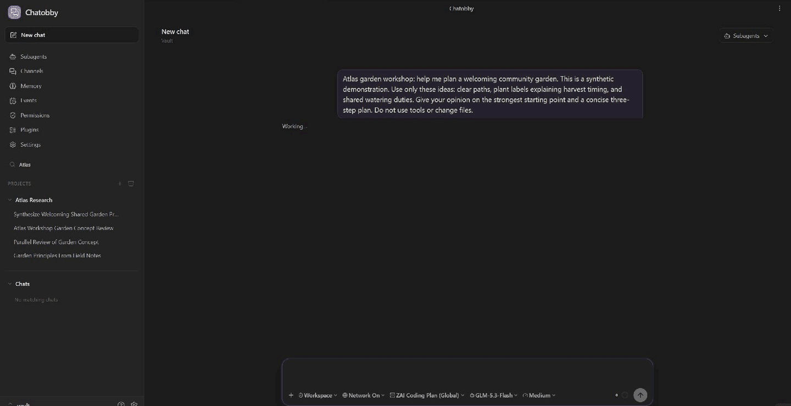
   A Project conversation and its linked note. <a href="assets/readme/workspace-chat.png">Still image</a>

## Feature highlights

- **[Agents in a group chat.](#channels)** Invite agents into Channels, talk to the group, or direct a question to one agent. Have a researcher and reviewer compare findings there.
- **[Custom subagents.](#custom-subagents)** Write reusable role prompts, choose models and skills, and return to each agent's conversation with follow-up work.
- **[Memory across chats.](#memory)** Agents save useful preferences and Project facts, update them as work changes, and reuse them in later conversations. Browse and edit the records yourself.
- **[Scheduled workflows.](#scheduled-events)** Ask for a weekly Project summary, a weekday note review, or work triggered by a file change. Inspect runs in Events.
- **[Obsidian notes and Projects.](#projects-and-notes)** Search notes, follow links, edit Markdown and work with folders outside the vault. Keep chats and notes side by side in native tabs.
- **[Web, shell, skills and MCP.](#tools-and-access)** Research online, run scripts, reuse skills and work with connected services.
- **[Operate Obsidian.](#obsidian-automation)** Arrange tabs, edit an unsaved selection, configure connections and build reusable plugin workflows.
- **[Your Obsidian theme.](#obsidian-themes)** Chatobby follows your theme, fonts and accent colours.

## Channels

Channels are group chats for you and your agents. Invite a few specialists, give
them a shared question, and watch them exchange findings. You can join the
discussion, reply to a message, search the history, or redirect the work.

  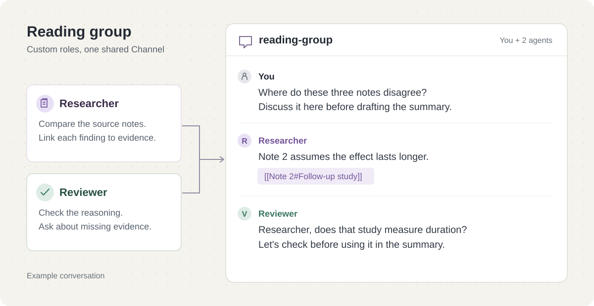

> Create a reading-group channel with a researcher and a reviewer. Have them
> compare the arguments in these three notes, discuss where they disagree,
> and bring me a summary with links to the relevant passages.

- **Broadcast** a plan or update to the Channel.
- **DM one agent** for a focused question without waking everyone. DMs remain visible in the Channel history.
- **Invite an idle, live agent** to bring it into the discussion; the invitation can start its next turn.

  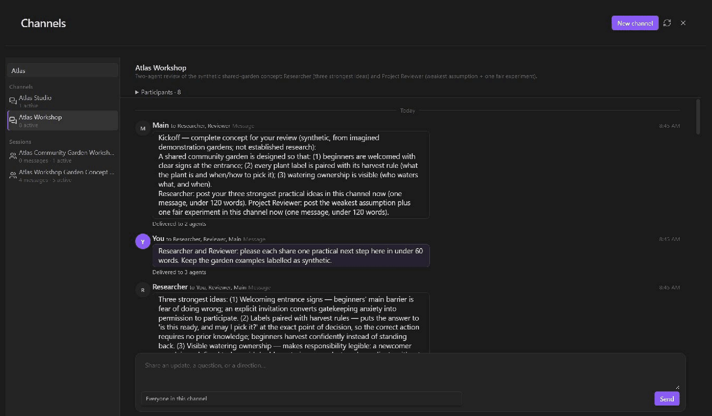
   Agent discussion and a targeted message draft. <a href="assets/readme/channels.png">Still image</a>

[Channel invitations and delivery →](docs/subagents.md#channels-and-direct-messages)

## Custom subagents

Keep a writing editor, a coding assistant or a research partner with instructions
suited to your work. In **Subagents → Roles**, save a prompt, model and tool choices
for your Vault or a Project. Open each agent's conversation to read its work,
send another message or stop it.

A role prompt could be as simple as:

> You are my study-note reviewer. Check definitions against the source notes,
> point out missing steps, and suggest three questions I should be able to answer.
> Link to the relevant headings. Leave the notes unchanged unless I ask for edits.

  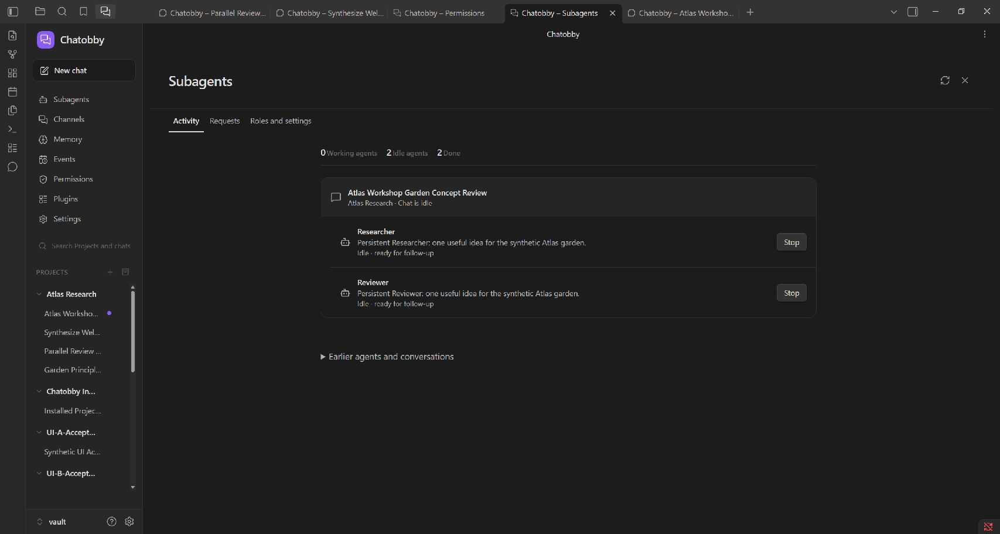

Agents can continue across turns; finishing an answer does not discard the
conversation. Choose different models for different roles and coordinate them
through Channels. Chatobby has no lifetime token or turn cap for subagents;
provider limits and usage charges still apply.

[Role setup and continuing conversations →](docs/subagents.md) ·
[Project-wide instructions with chatobby.md →](docs/project-guidance.md)

## Memory

Chatobby can save preferences, decisions and Project facts for later chats. An
agent can look up those records, correct an outdated fact or remove information
that no longer applies. Choose automatic saving, review suggestions first, or
turn memory off.

  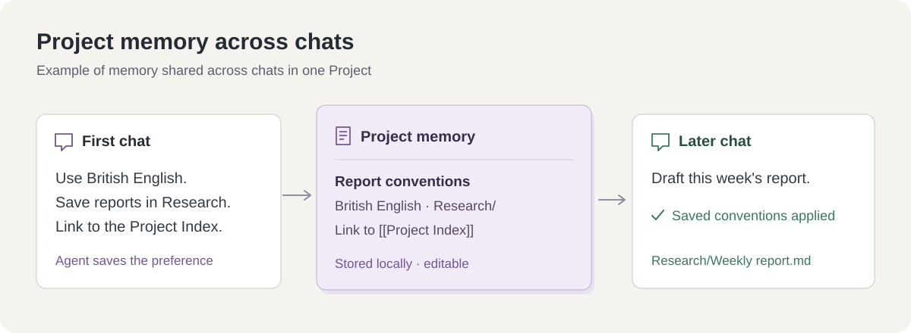

> Remember for this Project: use British English, put reports in Research,
> and link each report to the Project Index.

Open **Memory** to search, edit or delete records. Select a Project to browse its
memory while keeping your current conversation open.

  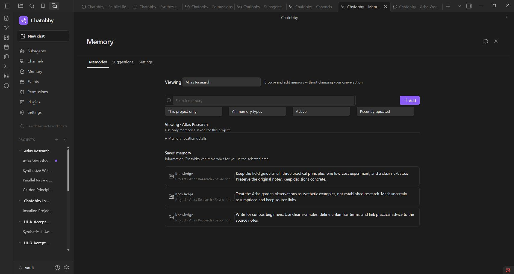

[Memory setup →](docs/alpha-guide.md) · [Storage and deletion →](PRIVACY.md)

## Scheduled events

Ask Chatobby to create an Event with a prompt and schedule. Events can run once,
repeat, respond to filesystem changes, or run from a named command. Assign the
work to the main agent or a saved role, then inspect its definition and run
history from **Events**.

  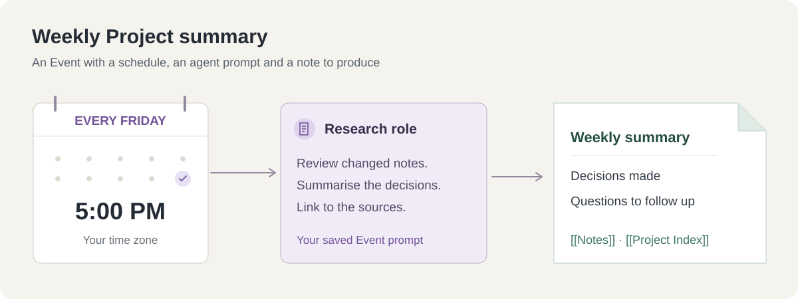

> Every Friday at 5 PM, review this Project's notes changed during the week.
> Write a weekly summary with decisions, open questions and links to the notes.
> Show me the Event before enabling it.

Schedules run locally while the runtime is running. Background execution has
its own setting; Events do not run on a Chatobby cloud service.

[Schedules, triggers and run history →](docs/events.md)

## Projects and notes

Use a Vault chat for your notes, or create a Project for a particular collection
of folders. A Project can include a folder outside the vault, such as a code
repository. Search, collapse and reorder Projects and chats in the sidebar.

- Reference notes with **@**, or ask the agent to search for relevant material.
- Create and edit Obsidian Markdown with wikilinks, properties, callouts and tasks.
- Open linked results beside the conversation. Chats and feature pages use native Obsidian tabs.
- Add writing conventions or workflow instructions in **chatobby.md**. Repository **AGENTS.md** and **CLAUDE.md** files are supported too.
- Search earlier conversations when a decision or useful answer is buried in chat history.

  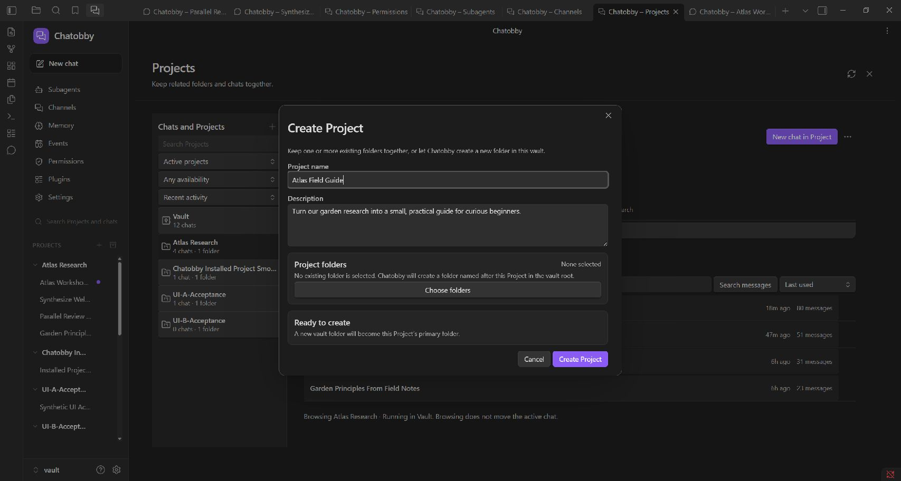

> Compare my lecture notes with this week's reading. Add a revision note with
> the key definitions, worked examples and links back to the sources.

[Projects and folders →](docs/projects.md) · [Custom instructions →](docs/project-guidance.md)

## Models and subscriptions

Connect accounts and model servers in **Settings**, then pick a model in the
composer. These connections use Chatobby's tools, memory and agent workflow.

| Connection | Examples |
| --- | --- |
| Subscription sign-in | ChatGPT, GitHub Copilot, xAI for eligible SuperGrok / X Premium accounts |
| API-token plans | OpenCode Zen / Go, Kimi Coding, Z.AI Coding Plan, Xiaomi Token Plan |
| Provider API keys | OpenAI, Anthropic, Google Gemini, xAI, DeepSeek, Mistral, Groq, MiniMax and others |
| Model gateways and cloud platforms | OpenRouter, Hugging Face, Azure OpenAI, Amazon Bedrock, Google Vertex AI |
| Local model servers | Ollama, LM Studio, vLLM, llama.cpp and compatible endpoints |

Your account determines which subscription models are available. Chatobby
refreshes account model choices when you open the picker. Local model servers
run on your hardware and can be used without a paid model-provider account.

  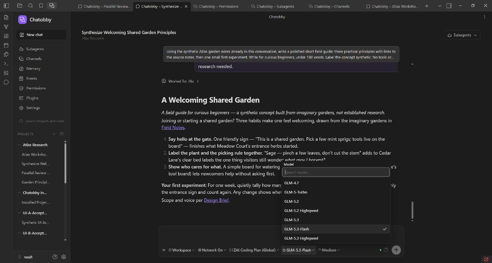

[All providers, sign-in and local-server setup →](docs/providers-and-models.md)

## Obsidian automation

Ask Chatobby to arrange tabs, edit your open note, inspect a plugin view or
configure a model connection. It can discover Obsidian commands, look up public
APIs and run live scripts, with the required app access.

> Connect my running LM Studio server, find its models and add the one I choose.
> Keep the server defaults and test the saved connection.

In **Settings → Connect server**, **Find models** reads the server's model list
and supported configuration. Keep automatic context and server output defaults,
or expand a model to customize its settings.

Build repeatable capture with QuickAdd, generate notes with Templater, or schedule
agent work in Events. Chatobby checks which plugins are enabled before using them.

[App automation and examples →](docs/obsidian-automation.md) ·
[Connect a local model →](docs/local-model-connections.md)

## Tools and access

Chatobby includes file editing, shell commands, web research, Obsidian tools,
memory, session-history search and agent coordination. Add **skills** for reusable
workflows or connect **MCP servers** for more tools and services.

  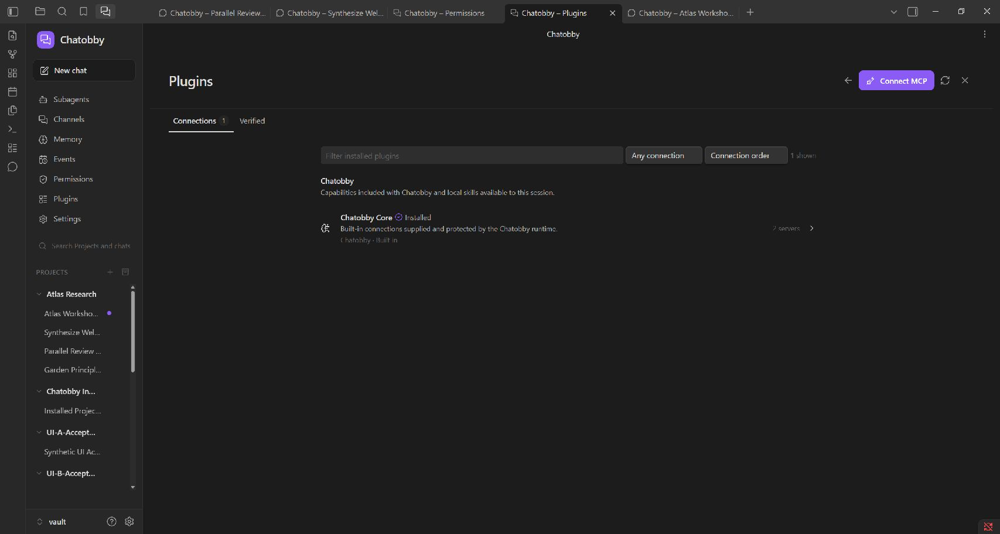

Chatobby 0.5.3 runs with **Full access**. Access-mode and network controls are
temporarily hidden. **Permissions** manages Obsidian app access; **Plugins**
manages MCP connections and individual tool selections. Memory and session-history
queries keep their Project scope independently of file and command access.

[Connect MCP servers →](docs/mcp-connections.md) ·
[Obsidian CLI and terminal →](docs/obsidian-cli-and-terminal.md) ·
[Full access →](docs/alpha-guide.md#full-access-in-053) · [Security →](SECURITY.md)

## Obsidian themes

Chatobby follows Obsidian's theme, fonts and accent colours. Arrange a chat,
Channel or Memory tab alongside your notes using Obsidian's tabs and splits.

<!-- Theme comparison: insert the user's diagonal split capture of the same completed chat in two Obsidian themes here. -->

## Install

1. In Obsidian, open **Settings → Community plugins → Browse**, find **Chatobby**, and install and enable it.
2. Open Chatobby from the ribbon and select **Install runtime** to complete setup.
3. Open Chatobby's **Settings** to connect a provider, sign in with a supported subscription, or add your local model server.
4. Pick a model and start a chat. Create a Project if you want to work with a specific set of folders.

  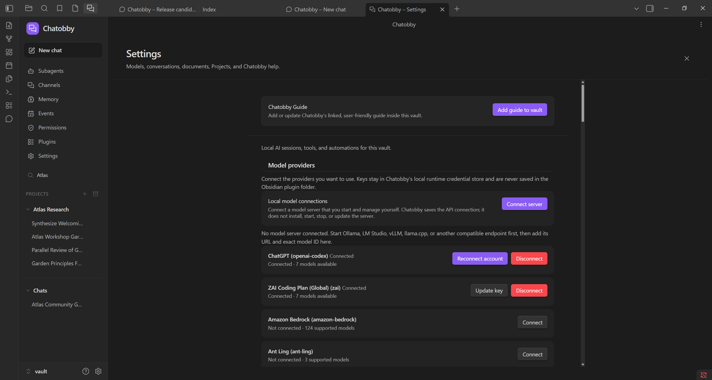

**Requires Obsidian desktop 1.11.4 or newer.** Windows x64 is the primary platform.
macOS 11+ and glibc Linux, each on x64 or arm64, are experimental. Mobile is not
supported. Chatobby is currently in alpha.

[Installation and updates →](docs/installation.md) ·
[Troubleshooting →](docs/troubleshooting.md) ·
[Connector 0.5.3](https://github.com/TitanicEclair/chatobby-obsidian/releases/tag/0.5.3) ·
[Runtime 0.5.3](https://github.com/TitanicEclair/chatobby-runtime/releases/tag/0.5.3)

## Roadmap

Planned additions:

- More capable agent knowledge and memory systems.
- New chat modes and effort modes.
- Session chat annotations.
- Inline note comments.

## Feedback and support

Share a role prompt, an Event you've found useful, or a workflow you'd like
Chatobby to support. For bugs, include the steps to reproduce and your Obsidian,
Chatobby and operating-system versions.

[Discussions](https://github.com/TitanicEclair/chatobby-obsidian/discussions) ·
[Issues](https://github.com/TitanicEclair/chatobby-obsidian/issues) ·
[Email](mailto:thatsmad002@gmail.com) ·
[Support development on Patreon](https://www.patreon.com/cw/MadelynCruzTan/membership)

The core harness will remain free. Optional support does not unlock features or
provide priority support. Model providers set their own subscription and API prices.

[License](LICENSE) · [Third-party notices](THIRD_PARTY_NOTICES.txt) ·
[Privacy](PRIVACY.md) · [Security](SECURITY.md) · [Support](SUPPORT.md)

Screenshots and edited GIF recordings use sample notes in Obsidian. The workflow diagrams are illustrations.

