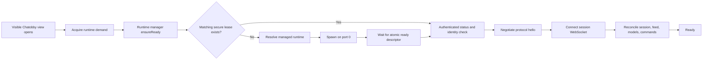

# Managed Runtime Lifecycle Architecture

> **Status:** Implemented through the managed lifecycle, demand-driven UI,
> multi-call runtime, detached background lifetime, and backend-active Events
> service. Release signing/distribution remains a release-engineering gate.
>
> **Scope:** Chatobby Obsidian plugin, Chatobby backend control plane, managed
> process lifecycle, startup UI, and the executable boundary required by later
> packaging and background-event work.
>
> **Companion documents:**
> - `docs/tooling/bundling-routing-plan.md` — frontend bundle boundaries
> - `docs/backend-sync.md` — backend/client synchronization
> - `C:\chatobby\pi-mono\packages\chatobby\docs\events-automation-architecture.md`
>   — session-active and backend-active events

## 1. Purpose

Opening or restoring a Chatobby view must make Chatobby usable without asking a
normal user to start a terminal command. The plugin should render immediately,
ensure the correct backend runtime is available, connect, restore the active
session, and keep user input safe throughout startup or recovery.

The view must not directly own a child process. Process ownership belongs to a
plugin-scoped runtime manager because one backend serves multiple UI actions and
may need to remain alive after the view closes for active agent turns,
subagents, and future events.

This document captures the accepted architecture and its implementation record.
The detailed Phase 1 and Phase 2 plans remain below as audit criteria rather
than future-looking proposals.

### 1.1 Implementation record

| Area | Implemented surface | State |
|---|---|---|
| Runtime control plane | Authenticated status/detach/shutdown, atomic ready descriptor, parent watchdog, signals | Complete |
| Plugin runtime ownership | `src/runtime/` manager, secure lease adoption, dynamic ports, single-flight startup, bounded restart breaker | Complete |
| View and composer | Lazy view demand, readiness-aware actions, retained draft, inline status/menu, managed/external/developer modes | Complete |
| Runtime executable | `serve`, `worker`, `mcp obsidian`, `mcp tools`, `doctor`, and `version` in one Bun-built executable | Complete |
| Artifact verification | Signed manifest generator plus checksum/signature/platform/protocol/plugin-range verification, atomic install, rollback | Core complete; production key and release hosting pending |
| Background lifetime | Explicit opt-in detached managed process with no Obsidian parent watchdog | Complete for process lifetime; not an OS login/reboot service |
| Events | Cron, vault-relative file watch, named commands, approval/consent gates, budgets, leases, recovery, history, UI, slash command, and agent tools | Complete |
| Distribution | Automatic companion download and community-store disclosure/review | Release gate; intentionally not enabled silently |

The source of truth for Events is
`<vault>/.chatobby/events/events.json`. Event execution sessions are isolated
under `<vault>/.chatobby/events/sessions/`. Executables, instance credentials,
descriptors, and logs remain machine-local.

## 2. Accepted product decisions

1. **Lazy automatic startup is the default.** Opening a visible Chatobby view
   requests runtime availability. Plugin `onload()` remains lightweight.
2. **The view requests availability; it does not spawn.** A plugin-scoped
   `ChatobbyRuntimeManager` owns resolution, identity, startup, recovery, and
   shutdown.
3. **The default lifetime is the Obsidian application session.** Closing the
   view does not terminate active work. Obsidian exit or plugin disable causes a
   graceful shutdown after a short reattachment grace period.
4. **Background automation is an explicit mode.** Cron, filesystem, and
   command events that must survive the view or Obsidian itself belong to the
   backend-active Events service, not a sleeping view or agent loop.
5. **One managed runtime per vault is the initial scalable model.** The current
   backend fixes `cwd` and `agentDir` at process startup, so sharing one process
   across vaults would be incorrect without a larger runtime-router redesign.
6. **Managed runtimes use dynamic loopback ports.** Port `0` is requested and
   the actual endpoint is learned from a readiness descriptor. Fixed ports are
   reserved for external/developer configurations.
7. **A listener is never proof of identity.** Runtime adoption requires a
   matching vault id, instance id, protocol version, runtime version, and
   authenticated health response.
8. **Stopping by port is prohibited.** Chatobby may gracefully stop an
   authenticated managed instance or terminate the exact child process it
   spawned. It must never kill an arbitrary port owner.
9. **Readiness means usable, not spawned.** The runtime becomes `ready` only
   after the server is listening, identity is verified, protocol negotiation
   succeeds, the WebSocket is connected, and the session can be reconciled.
10. **The composer remains usable during startup.** Drafting is always allowed.
    Sending waits for readiness without losing or duplicating the draft.
11. **Routine startup is quiet.** Fast startup uses only the connection
    indicator. Longer startup or action-required failure appears inline, not as
    a modal or repeated Notice.
12. **Normal settings stay product-oriented.** Runtime mode, startup behavior,
    lifetime, version, repair, and diagnostics are user-facing. Raw command,
    arguments, PID, and port live under Developer/Advanced controls.
13. **The packaged runtime is one multi-call executable.** The main
    server, worker subagents, and bundled MCP servers use subcommands of the same
    signed runtime so child processes cannot accidentally use the wrong Node or
    package checkout.
14. **Executable files stay outside the vault.** Machine-local runtime binaries,
    instance leases, control credentials, and logs are not synced as vault data.
15. **The primary session socket is authenticated.** Loopback binding alone is
    not sufficient protection against another local process.

## 3. Historical baseline and resolved gaps

This section records the pre-implementation state used to derive the plan. The
listed `src/backend/` files and unsafe port behavior have been removed; current
runtime ownership lives under `src/runtime/`. Keep this baseline for migration
history, not as a description of the live implementation.

### 3.1 Existing useful foundations

| Surface | Current responsibility |
|---|---|
| `src/backend/backend-controller.ts` | Spawn/adopt orchestration, reconnect, restart, stop, vault launch arguments |
| `src/backend/process.ts` | Child process creation and platform-specific termination |
| `src/backend/port-utils.ts` | Port probing and port-owner termination |
| `src/main.ts` | Plugin composition, transport ownership, backend controller wiring |
| `src/ui/view.ts` | View lifecycle, transport binding, session reconciliation |
| `src/transport/ws-client.ts` | Session WebSocket connection and reconnect state |
| `packages/chatobby/src/ws-server.ts` | Loopback HTTP/WebSocket server and a usable `shutdown()` method |
| `packages/chatobby/src/main.ts` | Vault-bound runtime composition and server startup |

Useful behavior to preserve:

- vault root, agent directory, and attachment directory are passed to the
  backend;
- plugin reload detaches frontend resources without immediately destroying
  backend work;
- backend state is observable by UI components;
- transport and Obsidian bridge ownership remain plugin-scoped;
- backend restart already has bounded exponential delay values;
- the backend server can listen on port `0` and exposes its actual address.

### 3.2 Gaps that block safe automatic startup

1. `ChatobbyView.onOpen()` only binds a transport when the backend is already
   starting or running. It does not request startup.
2. Prompt and session actions tell the user to start the backend manually.
3. `ChatobbyBackendProcess` reports `running` on the OS `spawn` event, before
   the backend is listening or initialized.
4. An occupied port is adopted using only a TCP probe. It may not be Chatobby,
   may belong to another vault, or may implement an incompatible protocol.
5. Stop behavior can terminate whatever owns a configured port.
6. Managed and external server semantics are combined in `serverUrl`,
   `backendCommand`, and `backendArgs`.
7. The fixed default port collides when multiple vaults or Obsidian windows run.
8. Restart attempts do not enter a terminal circuit-breaker state.
9. The backend exposes `ChatobbyWsServer.shutdown()` but CLI startup does not
   connect it to signals, parent death, or an authenticated control request.
10. The main session WebSocket does not perform an identity/authentication
    handshake before leasing an agent runtime.
11. The current binary build script creates the Pi CLI binary, not a Chatobby
    runtime artifact.
12. Worker-process subagents and MCP server configuration still rely on Node,
    package resolution, or external JavaScript paths that a sealed executable
    cannot assume.

Existing tests under `tests/backend/backend-controller.test.ts` intentionally
assert unverified port adoption and port-owner killing. Phase 1 must replace
those assertions rather than preserve them.

## 4. Target architecture

### 4.1 Control plane and data plane

The lifecycle control plane and agent data plane are separate:

| Plane | Purpose | Examples |
|---|---|---|
| Runtime control | Install/resolve, start, identify, health, stop, version, diagnostics | ready descriptor, `/api/runtime/status`, `/api/runtime/shutdown` |
| Agent session | Prompts, model output, sessions, tasks, subagents | existing Chatobby WebSocket protocol |
| Obsidian bridge | Authenticated backend requests for vault operations | existing `/api/obsidian/bridge` WebSocket |

Runtime controls are plugin infrastructure. They are not model tools and must
not become callable by the agent simply because they share a server.

### 4.2 Startup flow



`ensureReady()` is single-flight. Concurrent calls from a restored view, a
composer send, and an Obsidian command await the same promise and cannot spawn
duplicates.

### 4.3 Plugin module boundaries

The current `src/backend/` implementation should migrate behind a documented
runtime API rather than expand into the view:

```text
src/runtime/
  public.ts                         only import surface for plugin/UI consumers
  contracts.ts                      lifecycle states, failures, descriptors, settings
  application/
    runtime-manager.ts              ensureReady, restart, stop, detach, state
    demand-registry.ts              view/run/event demand ownership
    restart-policy.ts               backoff and circuit breaker
  infrastructure/
    managed-process.ts              spawn and exact-child fallback termination
    ready-descriptor-store.ts       atomic machine-local descriptor access
    runtime-control-client.ts       authenticated status/shutdown
    runtime-lease-store.ts          verified instance and control credential
    runtime-resolver.ts             developer now; installed executable in Phase 3
    platform-paths.ts               machine-local runtime/state/log directories

src/features/runtime-status/
  public.ts                         UI-facing status feature surface
  application/runtime-status-controller.ts
  presentation/runtime-status-banner.ts
  presentation/runtime-status-menu.ts
  presentation/runtime-status.css
```

Rules:

- UI and `ChatobbyView` import only `src/runtime/public.ts` and the runtime-status
  feature public surface.
- Infrastructure modules never import UI modules or Obsidian view classes.
- `src/main.ts` composes services but contains no startup algorithm.
- The session transport consumes the endpoint returned by the runtime manager;
  it does not read process settings directly.
- Existing `src/backend/` modules are removed after their behavior has migrated
  and their tests have been replaced.

### 4.4 Backend control modules

```text
packages/chatobby/src/control/
  contracts.ts                      runtime identity and status response
  runtime-service.ts                start/stop composition and shutdown idempotency
  ready-descriptor.ts               atomic descriptor write/remove
  authentication.ts                token load, constant-time verification
  http-routes.ts                    status and shutdown control endpoints
  parent-watchdog.ts                parent death and reattachment grace
  signal-handlers.ts                SIGINT/SIGTERM integration
```

`packages/chatobby/src/main.ts` should return or construct a runtime-service
handle instead of starting an unreachable server and returning no lifecycle
surface. `packages/chatobby/src/cli.ts` owns argument parsing failure, signals,
exit codes, and final cleanup.

### 4.5 Runtime state model

```ts
type RuntimeLifecycleState =
  | { status: "idle" }
  | { status: "resolving" }
  | { status: "install-required"; platform: string }
  | { status: "installing"; progress?: number }
  | { status: "spawning"; attempt: number }
  | { status: "handshaking"; endpoint: string }
  | { status: "connecting"; endpoint: string }
  | { status: "ready"; identity: RuntimeIdentity; endpoint: string }
  | { status: "restarting"; attempt: number; retryAt: number; reason: string }
  | { status: "stopping" }
  | { status: "failed"; failure: RuntimeFailure; canRetry: boolean };

interface RuntimeIdentity {
  instanceId: string;
  vaultId: string;
  pid: number;
  startedAt: number;
  runtimeVersion: string;
  protocolVersion: number;
}

type RuntimeFailureCode =
  | "runtime_missing"
  | "runtime_incompatible"
  | "runtime_damaged"
  | "spawn_denied"
  | "readiness_timeout"
  | "identity_mismatch"
  | "authentication_failed"
  | "connection_failed"
  | "crash_loop"
  | "external_unavailable"
  | "shutdown_failed";
```

The UI renders semantic state and failure codes. It must not infer product state
from raw process exit strings.

### 4.6 Runtime identity, readiness, and control

Managed startup uses the following inputs:

```text
chatobby serve
  --vault-id <stable-vault-hash>
  --vault-root <absolute-path>
  --agent-dir <absolute-path>
  --attachment-dir <absolute-path>
  --instance-id <uuid>
  --parent-pid <obsidian-pid>
  --port 0
  --ready-file <machine-local-path>
  --control-token-file <machine-local-path>
  --session-token-file <machine-local-path>
```

The plugin creates the instance id plus separate control and session tokens
before spawning. The control token can inspect or stop the runtime; the
session token can only authenticate the agent WebSocket. Secrets must not
appear in command-line arguments or Obsidian `data.json`.

After initialization and successful `listen()`, the backend atomically writes:

```ts
interface RuntimeReadyDescriptor {
  schemaVersion: 1;
  instanceId: string;
  vaultId: string;
  pid: number;
  startedAt: number;
  host: "127.0.0.1";
  port: number;
  runtimeVersion: string;
  protocolVersion: number;
  controlTokenFingerprint: string;
  sessionTokenFingerprint: string;
}
```

The descriptor contains no bearer token. The scoped tokens are held in
separate, machine-local, owner-readable files so plugin reload can reattach
safely without granting session connections runtime-administration authority.

The backend control API is loopback-only and authenticated:

```text
GET  /api/runtime/status
POST /api/runtime/detach
POST /api/runtime/shutdown
```

`status` returns the complete runtime identity and a readiness flag. `detach`
starts the bounded plugin-reload reattachment grace period; a successful
authenticated hello cancels that timer. `shutdown` is idempotent and returns an
acknowledgement before closing listeners. These routes require the control
token. The plugin first requests graceful shutdown and waits for exit. It may
then terminate only the exact managed child represented by the verified lease.

The plugin control client uses Node's loopback HTTP transport, with no pooled
agent, a bounded timeout, and a bounded JSON response body. It must not use the
renderer's DOM `fetch`: Electron applies browser-origin networking policy to
renderer requests, which can reject a healthy loopback control endpoint before
the bearer-token exchange. The agent-session WebSocket remains the separate
data plane.

The session WebSocket begins with a versioned hello before the backend leases an
agent runtime:

```ts
interface RuntimeClientHello {
  type: "hello";
  protocolVersion: number;
  pluginVersion: string;
  instanceId: string;
  vaultId: string;
  sessionToken: string;
}

interface RuntimeServerHello {
  type: "hello_ack";
  protocolVersion: number;
  runtimeVersion: string;
  instanceId: string;
  vaultId: string;
}
```

Authentication and compatibility complete before `leaseRuntime()` creates an
agent session. Incompatible or unauthorized connections close with stable,
documented application codes.

### 4.7 Machine-local and vault-local storage

| Data | Location | Rationale |
|---|---|---|
| Runtime executable versions | machine-local Chatobby cache | immutable, platform-specific, not vault content |
| Instance descriptor and scoped control/session tokens | machine-local instance directory keyed by vault hash | private, reattachable, not synced |
| Rotated runtime logs | machine-local logs directory | diagnostics without vault noise |
| Agent configuration and credentials | vault `.chatobby/agent` | existing vault-scoped runtime contract |
| Attachments | vault `.chatobby/attachments` | existing vault-scoped artifact contract |
| Sessions, tasks, memory, workflows | existing backend-owned vault/agent paths | unchanged by lifecycle work |

Platform paths must come from one `platform-paths.ts` abstraction. The view and
feature code must not hardcode `.obsidian`, `%LOCALAPPDATA%`, or equivalent
platform directories.

### 4.8 Vault and process model

- A stable vault id is derived from the normalized physical vault path and a
  Chatobby namespace. The raw vault path is not exposed in public diagnostics.
- Multiple Chatobby leaves in one vault share one runtime manager and one
  single-flight readiness promise.
- Multiple vaults receive separate instance directories and dynamic ports.
- A descriptor from another vault is never adopted.
- A stale descriptor is removed only after the recorded PID/identity fails
  authenticated health verification.
- External mode never writes or adopts a managed-runtime descriptor.

### 4.9 Lifetime and demand model

```ts
type RuntimeDemandKind =
  | "visible-view"
  | "pending-user-action"
  | "active-agent-turn"
  | "active-subagent"
  | "session-event"
  | "backend-event";
```

Phase 2 implements view and pending-action demand. Agent, subagent, and event
demands are reserved in the contract so later work does not invent a competing
lifecycle mechanism.

Default policy:

1. First visible view or user action starts the runtime.
2. Closing the view releases its demand but does not stop the runtime during the
   current Obsidian application session.
3. Plugin reload detaches transport and leaves a short reattachment lease.
4. Plugin disable or parent-process death causes graceful shutdown after the
   grace window.
5. Explicit `background` mode starts a detached managed runtime without an
   Obsidian parent PID, so Events can continue while Obsidian is closed. It does
   not currently register an OS login/reboot service.

This keeps the backend-active Events service compatible with
`events-automation-architecture.md`: closing a chat view does not silently
cancel backend-active definitions, and persistent automation is never
implemented as an agent sleep loop.

## 5. UI and UX contract

### 5.1 View opening

`ChatobbyView.onOpen()` follows this sequence:

1. Build the shell, feed, composer, and status component immediately.
2. Subscribe to runtime state.
3. Acquire `visible-view` demand without awaiting backend startup in the render
   path.
4. Call `ensureReady({ trigger: "view-open" })` asynchronously.
5. On `ready`, bind the returned endpoint, connect transport, and reconcile the
   active session.
6. On recoverable failure, keep the draft and show the inline action.

If Obsidian restores an already-visible Chatobby view, the same flow runs after
the workspace layout is ready. Hidden deferred views must not be force-loaded
solely to start the backend.

### 5.2 Startup presentation

| Condition | Presentation |
|---|---|
| Resolves in under approximately one second | animated connection indicator only |
| Longer resolving/spawning/handshaking | thin inline banner: `Starting Chatobby…` plus semantic stage |
| Restarting after crash | `Chatobby disconnected. Reconnecting…` with attempt and Cancel |
| Ready | banner disappears; status indicator becomes ready |
| Action required | persistent inline card with one primary recovery action and optional details |

Routine lifecycle changes do not produce Obsidian Notices. A Notice is reserved
for a user-requested command that cannot be represented in the active Chatobby
view.

### 5.3 Composer behavior

- The textarea remains enabled during all startup states.
- Send during startup creates one `pending-user-action` demand and awaits the
  current readiness promise.
- The draft is cleared only after the backend accepts the prompt.
- The optimistic user feed block is added only once the prompt is accepted, or
  uses a stable pending id that is promoted exactly once.
- Canceling startup leaves the draft untouched.
- Failure shows concise inline guidance beside the composer; it must not append
  duplicate pseudo-user or system messages to the conversation.

### 5.4 Runtime status menu

The connection indicator becomes an accessible button opening a compact menu:

- semantic state: Ready, Starting, Reconnecting, Stopped, or Needs attention;
- managed/external/developer mode;
- runtime version and compatibility;
- Restart;
- Stop, with confirmation when active agent/subagent/event work is reported;
- Open logs;
- Copy diagnostics;
- Repair or Update when applicable.

PID, port, executable path, raw command, and raw arguments are shown only in an
expanded diagnostics/developer section.

### 5.5 Settings

```ts
type RuntimeMode = "managed" | "external" | "developer";
type RuntimeStartup = "view-open" | "first-action";
type RuntimeLifetime = "obsidian-session" | "background";
```

Initial product settings:

- **Runtime mode:** Automatic/managed by default.
- **Start Chatobby:** When the Chatobby view opens by default.
- **Keep Chatobby available:** Until Obsidian closes by default.
- **Runtime:** installed version, update/repair, logs, and diagnostics.
- **External:** server URL and credential, visible only in external mode.
- **Developer:** executable/command and arguments, visible only in developer
  mode.

Background lifetime is explicitly labeled as continuing after Obsidian closes.
It requires separate per-event consent before an Event may execute without a
visible Chatobby view. No idle lifetime is exposed.

### 5.6 Failure mapping

| Failure code | Primary UI action |
|---|---|
| `runtime_missing` | Install runtime |
| `runtime_incompatible` | Update runtime |
| `runtime_damaged` | Repair installation |
| `spawn_denied` | Show platform permission help and Retry |
| `readiness_timeout` | Retry; details show bounded startup logs |
| `identity_mismatch` | Start a new dynamic-port instance; never kill the listener |
| `authentication_failed` | Repair secure instance credentials |
| `connection_failed` | Retry connection |
| `crash_loop` | Open diagnostics; manual Restart resets the breaker |
| `external_unavailable` | Retry external connection |
| `shutdown_failed` | Show diagnostics and exact managed-process fallback result |

## 6. Packaged executable and distribution boundary

The target runtime is one platform-specific, signed, multi-call executable:

```text
chatobby serve
chatobby worker
chatobby mcp obsidian
chatobby mcp tools
chatobby doctor --json
chatobby version --json
```

Worker-process subagents spawn `process.execPath worker ...`, and generated MCP
configuration invokes the same executable with `mcp` subcommands. In-process
subagents remain in process. This prevents a child from resolving the wrong
Node, checkout, package version, or worker script.

The standard Obsidian community installer installs `main.js`, `manifest.json`,
and `styles.css`, not a platform executable (see
[Obsidian's plugin release documentation](https://docs.obsidian.md/Plugins/Releasing/Submit%20your%20plugin)).
The implementation supports a verified machine-local artifact and a runtime
bundled inside a non-community distribution. Product release must choose and
validate one distribution path:

1. one-time, explicitly approved, verified runtime download from the plugin;
2. a separately signed Chatobby Runtime installer; or
3. a custom distribution mechanism outside the community installer.

The recommended product flow is a one-time installation card followed by
automatic startup. Runtime manifests map plugin/protocol compatibility to
platform artifacts with URL, size, SHA-256, and signature. Downloads go to a
temporary file, verify before execution, install atomically, and never replace
a running version in place. Network and external-file behavior must be disclosed
and confirmed against Obsidian community review policy before release.

The multi-call build, resolver, manifest generator, verified installer, atomic
pointer switch, rollback, repair primitives, and doctor command are implemented.
Automatic network download is deliberately absent until a production signing
key, artifact host, disclosure text, and Obsidian community-policy review are
approved. Developer mode remains the correct live-development path.

Managed resolution order is explicit override, compatible runtime bundled with
the plugin, verified machine-local current installation, then `chatobby` on
`PATH`. A custom distribution's bundled runtime therefore cannot be silently
shadowed by a stale machine-local pointer.

## 7. Phase 1 plan: lifecycle identity, readiness, dynamic ports, shutdown, and crash limits

### 7.1 Goal

Make manual managed-runtime startup safe and deterministic before any view opens
it automatically. At the end of Phase 1, the runtime manager can start or
reattach only the correct vault runtime, can prove readiness, can stop it
gracefully, and stops retrying after a bounded crash loop.

### 7.2 Backend work packages

#### P1-B1. Introduce runtime control contracts

Files:

- add `packages/chatobby/src/control/contracts.ts`;
- update `packages/chatobby/src/ws-types.ts` and `ws-client.ts` for hello types;
- update exported/public protocol declarations and generated client artifacts;
- update backend and plugin protocol docs.

Deliverables:

- `RuntimeIdentity`, `RuntimeReadyDescriptor`, `RuntimeStatusResponse`;
- versioned `RuntimeClientHello` and `RuntimeServerHello`;
- separate control-route and session-handshake credential scopes;
- stable incompatibility/authentication close codes;
- parsers/validators at all filesystem and network boundaries.

Acceptance:

- invalid descriptors and malformed hello frames fail closed;
- agent runtime allocation cannot occur before hello success;
- plugin and backend consume one generated contract surface rather than
  duplicate handwritten shapes.

#### P1-B2. Add runtime service and graceful lifecycle

Files:

- add `packages/chatobby/src/control/runtime-service.ts`;
- add `ready-descriptor.ts`, `authentication.ts`, `signal-handlers.ts`, and
  `parent-watchdog.ts`;
- update `packages/chatobby/src/main.ts`, `cli.ts`, and `ws-server.ts`.

Deliverables:

- backend startup returns an owned runtime-service handle;
- descriptor is atomically written after `listen()` and removed on shutdown;
- `SIGINT` and `SIGTERM` call one idempotent shutdown path;
- CLI catches startup failure, writes actionable stderr, and sets a non-zero
  exit code;
- optional parent watchdog observes parent death with a reattachment grace;
- shutdown closes session sockets, bridge routes, subagents, MCP processes,
  server listeners, and router resources in a bounded order;
- WebSocket peers that do not answer the close handshake and HTTP clients that
  retain keep-alive sockets are forcibly disconnected only after a short grace;
- after that managed cleanup resolves, the Bun-compiled Windows `serve`
  entrypoint exits explicitly instead of relying on Bun to drain an already
  empty resource set.

Acceptance:

- startup on port `0` reports the actual port;
- descriptor never claims readiness before status succeeds;
- repeated shutdown requests are safe;
- normal shutdown leaves no backend, worker, or MCP child process behind;
- an authenticated packaged-runtime smoke test reaches session state, accepts
  shutdown, removes the ready descriptor, and exits with code `0`.

#### P1-B3. Add authenticated runtime control routes

Files:

- add `packages/chatobby/src/control/http-routes.ts`;
- route requests from `packages/chatobby/src/ws-server.ts` before bridge/session
  routing;
- add focused route tests.

Deliverables:

- authenticated `GET /api/runtime/status`;
- authenticated, idempotent `POST /api/runtime/detach`;
- authenticated, idempotent `POST /api/runtime/shutdown`;
- minimal unauthenticated responses that do not leak vault paths or tokens;
- constant-time credential comparison;
- loopback-only enforcement.

Acceptance:

- missing/wrong tokens cannot inspect identity, detach, or trigger shutdown;
- the session token cannot invoke control routes;
- status identity exactly matches the ready descriptor;
- detach starts a bounded grace period and an authenticated hello cancels it;
- shutdown acknowledgement is returned before listener teardown.

#### P1-B4. Gate session runtime allocation on hello

Files:

- update `packages/chatobby/src/ws-server.ts` connection admission;
- update `packages/chatobby/src/ws-client.ts` handshake behavior;
- update `packages/chatobby/test/ws-client.test.ts` and lifecycle tests.

Deliverables:

- first client frame is a bounded-time hello;
- vault, instance, token, and protocol are checked before `leaseRuntime()`;
- server sends `hello_ack` before normal commands/events;
- terminal close codes distinguish authentication, identity, and version
  failures;
- reconnect performs a fresh hello.

Acceptance:

- no session is created for an unauthorized socket;
- a client for vault A cannot attach to vault B;
- incompatible plugin/runtime versions produce an actionable stable error.

### 7.3 Plugin work packages

#### P1-P1. Establish runtime public API and state model

Files:

- add `src/runtime/contracts.ts` and `src/runtime/public.ts`;
- add `src/runtime/application/runtime-manager.ts`;
- update `src/main.ts` composition;
- migrate `BackendProcessState` out of the broad `src/types.ts` surface.

Public API:

```ts
interface ChatobbyRuntimeManager {
  readonly state: RuntimeLifecycleState;
  onStateChange(listener: (state: RuntimeLifecycleState) => void): () => void;
  ensureReady(request: EnsureRuntimeRequest): Promise<ReadyRuntime>;
  restart(reason: RuntimeActionReason): Promise<ReadyRuntime>;
  stop(reason: RuntimeActionReason): Promise<void>;
  detach(reason: RuntimeDetachReason): Promise<void>;
}

interface ReadyRuntime {
  identity: RuntimeIdentity;
  endpoint: string;
  ownership: "managed" | "external" | "developer";
}
```

Acceptance:

- all callers observe one semantic state source;
- simultaneous `ensureReady()` calls return the same in-flight result;
- UI code has no access to process primitives.

#### P1-P2. Replace port adoption with secure leases

Files:

- add `src/runtime/infrastructure/ready-descriptor-store.ts`;
- add `runtime-lease-store.ts` and `runtime-control-client.ts`;
- retire adoption and kill behavior in `src/backend/port-utils.ts`;
- migrate applicable controller tests.

Algorithm:

1. Read the vault-keyed machine-local descriptor and scoped tokens.
2. Validate schema, expected vault, supported protocol, and token fingerprints.
3. Call authenticated status.
4. Adopt only when returned identity exactly matches the descriptor.
5. If status fails, treat the descriptor as stale; do not kill its port owner.
6. Spawn a new dynamic-port runtime and replace the stale descriptor only after
   successful readiness.

Acceptance:

- arbitrary listeners are never adopted or killed;
- a valid process survives plugin reload and is reattached;
- stale lease cleanup cannot terminate another process.

#### P1-P3. Make process supervision readiness-aware

Files:

- migrate `src/backend/process.ts` to
  `src/runtime/infrastructure/managed-process.ts`;
- add bounded startup-log capture and exact-child identity;
- add unit tests with injectable spawn/clock/filesystem boundaries.

Deliverables:

- `spawn` transitions to `spawning`, not `ready`;
- manager waits for descriptor, authenticated status, and protocol hello;
- readiness timeout terminates only the child started by this attempt;
- stdout/stderr feed a bounded ring buffer and rotated logs rather than
  unstructured persistent console noise;
- fallback termination checks PID, start time, executable path, and instance id.

Acceptance:

- early exit, spawn error, timeout, invalid descriptor, and handshake failure
  each produce a stable failure code;
- no unresolved readiness promise remains after failure or cancellation.

#### P1-P4. Add bounded restart and crash-loop policy

Files:

- add `src/runtime/application/restart-policy.ts`;
- update runtime manager tests;
- replace unconditional rescheduling in the old backend controller.

Initial policy:

- automatic delays: 1 s, 2 s, 4 s;
- enter `crash_loop` after three failed starts within 60 seconds;
- a runtime stable for 60 seconds resets failure history;
- explicit user Restart resets the breaker once;
- stopping, detaching, or changing mode cancels pending timers.

Acceptance:

- fake-timer tests prove exact transitions and cancellation;
- no infinite background spawn loop remains;
- the terminal state contains bounded diagnostics and a manual recovery action.

#### P1-P5. Separate managed, external, and developer endpoints

Files:

- extend settings domain/store with `runtimeMode` and mode-specific settings;
- update transport construction to accept a runtime-provided endpoint;
- keep current raw command support only in developer mode.

Migration:

- an existing non-default command/argument configuration migrates once to
  `developer` mode;
- an existing explicitly remote URL migrates to `external` mode;
- the ordinary default becomes `managed` without exposing a fixed port;
- runtime-discovered endpoints are ephemeral and never persisted as user
  settings.

Acceptance:

- managed mode never connects to a stale persisted port;
- external mode never spawns or stops a process;
- developer mode remains usable for the local `node .../dist/cli.js` workflow.

### 7.4 Phase 1 tests

Backend focused tests:

- descriptor schema and atomic ready/remove behavior;
- port `0` readiness and identity;
- authenticated status and shutdown;
- unauthorized and cross-vault rejection;
- hello timeout, wrong version, wrong instance, wrong vault, wrong token;
- no runtime lease allocation before hello;
- SIGINT/SIGTERM and repeated shutdown;
- parent death/grace behavior;
- child worker/MCP cleanup on shutdown.

Plugin focused tests:

- single-flight `ensureReady()`;
- secure adoption after plugin reload;
- stale descriptor without port killing;
- occupied unrelated port has no effect;
- dynamic endpoint propagation to transport;
- startup timeout and exact-child cleanup;
- crash backoff, breaker, manual reset, and timer cancellation;
- managed/external/developer mode isolation;
- legacy settings migration.

Integration acceptance:

1. Start the backend on port `0` in a temporary vault and wait for descriptor.
2. Verify authenticated status identity.
3. Connect the real generated client and complete hello.
4. Request harmless session state.
5. Gracefully shut down and prove the process tree exits.
6. Repeat with a second temporary vault and prove distinct endpoints/identity.
7. Place a non-Chatobby listener on the old default port and prove it is neither
   adopted nor killed.

### 7.5 Phase 1 exit gate

Phase 1 is complete only when manual Start/Stop uses the new runtime manager and:

- no code path adopts or kills by port;
- readiness is authenticated and versioned;
- managed instances use dynamic ports;
- shutdown is graceful and bounded;
- restart reaches a terminal crash-loop state;
- two vaults can run concurrently;
- all changed backend and plugin focused tests pass;
- backend/client vendor artifacts and lifecycle documentation are synchronized.

## 8. Phase 2 plan: demand-driven view auto-start and inline runtime UI

### 8.1 Goal

Make opening, restoring, or using the Chatobby view automatically acquire the
safe runtime from Phase 1 while keeping Obsidian startup fast and making every
startup/recovery state understandable without developer knowledge.

### 8.2 Application work packages

#### P2-A1. Add runtime demand registry

Files:

- add `src/runtime/application/demand-registry.ts`;
- expose acquire/release through `src/runtime/public.ts`;
- compose it in `src/main.ts`.

Public API:

```ts
interface RuntimeDemandHandle {
  id: string;
  kind: RuntimeDemandKind;
  release(): void;
}

interface RuntimeDemandRegistry {
  acquire(kind: RuntimeDemandKind, ownerId: string): RuntimeDemandHandle;
  hasDemand(kind?: RuntimeDemandKind): boolean;
  snapshot(): readonly RuntimeDemandSnapshot[];
}
```

Rules:

- duplicate acquisition by the same owner/kind is idempotent;
- release is idempotent;
- the registry records reasons, not UI elements or DOM references;
- Phase 2 does not auto-stop on view release because default lifetime is the
  Obsidian session;
- future agent/subagent/event holders use the same registry.

#### P2-A2. Integrate visible-view startup

Files:

- update `src/ui/view.ts` `onOpen()`/`onClose()`;
- update `src/main.ts` workspace-ready coordination;
- add view lifecycle tests or extract a small injectable controller where direct
  `ItemView` testing is impractical.

Behavior:

- shell construction is not blocked by startup;
- visible view acquires demand and fire-and-observes `ensureReady()`;
- restored visible views start only after workspace layout readiness;
- hidden deferred views are not force-loaded;
- closing releases view demand and UI subscriptions but leaves the default
  runtime alive;
- reopening reuses the ready runtime and does not reconnect twice.

#### P2-A3. Make all user actions readiness-aware

Files:

- replace `ensureConnectedTransport()` in `src/ui/view.ts` with a runtime-aware
  action gateway;
- update session controller, provider refresh, memory, permission, subagent,
  compaction, and session-directory entrypoints as applicable;
- keep one shared `ensureRuntimeTransport(action)` application helper.

Behavior:

1. Acquire `pending-user-action` demand.
2. Await `runtime.ensureReady()`.
3. Bind or retrieve transport for the returned endpoint.
4. Await transport connection and session reconciliation when required.
5. Execute the action.
6. Release demand in `finally`.

Acceptance:

- no normal action says “Start the backend first” in managed mode;
- external/developer failures retain mode-specific wording;
- commands and UI actions use the same gateway.

### 8.3 UI work packages

#### P2-U1. Add runtime status controller and banner

Files:

- add `src/features/runtime-status/application/runtime-status-controller.ts`;
- add `presentation/runtime-status-banner.ts` and CSS;
- mount the feature in the view shell above the feed without changing feed
  ownership.

Controller output:

```ts
interface RuntimeStatusViewModel {
  visibility: "hidden" | "indicator" | "banner" | "action-card";
  tone: "neutral" | "progress" | "warning" | "error";
  title: string;
  detail?: string;
  stage?: string;
  primaryAction?: RuntimeUiAction;
  secondaryAction?: RuntimeUiAction;
  ariaLive: "off" | "polite" | "assertive";
}
```

Rules:

- use a short delay before showing the banner to avoid flashing during fast
  startup;
- stage text is semantic, not raw stderr;
- repeated identical state does not rebuild the DOM;
- failure details are collapsed by default;
- no feed block is created for ordinary lifecycle state.

#### P2-U2. Upgrade connection indicator into runtime menu

Files:

- update toolbar/view-shell connection control;
- add `runtime-status-menu.ts`;
- update theme-variable CSS and keyboard/ARIA behavior.

Actions:

- Restart and Stop call the runtime public API;
- Stop requests active-work summary before confirmation when available;
- Open logs and Copy diagnostics use redacted structured diagnostics;
- Repair/Update are present only when those Phase 3 capabilities exist;
- advanced details remain out of the default surface.

#### P2-U3. Preserve composer draft and send exactly once

Files:

- update composer host/controller boundary;
- add pending-send state separate from agent streaming state;
- update feed dispatch timing;
- add composer and feed regression tests.

Behavior:

- text remains visible/editable while runtime starts;
- Send changes to a waiting/progress affordance but does not clear text;
- one submitted draft maps to one backend prompt and one user feed item;
- startup failure restores the normal Send affordance with the draft intact;
- user Cancel cancels only the pending startup/send, not unrelated active work.

#### P2-U4. Replace developer-first settings

Files:

- restructure the Connection section in `src/settings.ts`;
- add runtime status/version row and mode-specific controls;
- hide raw command/args unless Developer mode is selected;
- document the new settings and migration.

Initial visible controls:

- Runtime mode;
- Start Chatobby: view open / first action;
- Keep available: until Obsidian closes;
- current runtime status/version;
- Restart, Stop, Open logs, Copy diagnostics.

External URL and developer command fields render only for their modes.

### 8.4 Phase 2 tests

Application tests:

- visible view acquires demand once and releases once;
- two restored/reopened views cannot cause duplicate startup;
- hidden deferred view does not start runtime;
- view shell renders before readiness resolves;
- every managed-mode action calls the shared readiness gateway;
- external mode never invokes managed startup;
- view close does not stop default-lifetime runtime;
- unload detaches and the grace path permits reattachment.

UI tests:

- sub-threshold startup shows indicator without banner flash;
- delayed startup shows correct stage and polite live region;
- ready hides the banner;
- each failure code maps to the intended action and wording;
- restart attempts and crash-loop state are represented accurately;
- status menu keyboard navigation, focus return, labels, and ARIA state;
- composer remains editable, retains draft on failure/cancel, and sends once;
- no lifecycle transition inserts a user or conversation feed block;
- theme variables work in light/dark themes and compact panes without overflow.

Live acceptance:

1. Ensure no Chatobby backend is running.
2. Open the Chatobby view and verify shell/composer appear immediately.
3. Verify exactly one managed process starts and reaches ready.
4. Send text during startup and confirm one prompt and one user message.
5. Close/reopen the view and confirm runtime reuse.
6. Reload the plugin and confirm authenticated reattachment without a new
   process.
7. Crash the managed process and observe bounded reconnect then recovery.
8. Repeatedly fail startup and confirm the terminal action card replaces the
   retry loop.
9. Open a second vault and confirm its runtime and endpoint are independent.
10. Stop from the runtime menu and confirm graceful process-tree cleanup.

Performance acceptance:

- plugin `onload()` performs no process start, runtime download, or network
  request;
- view shell construction does not await runtime I/O;
- runtime state updates patch existing DOM instead of rebuilding the feed;
- no polling occurs when event-driven process/control state is available;
- logs and diagnostics are bounded and loaded on demand.

### 8.5 Phase 2 exit gate

Phase 2 is complete only when:

- opening/restoring a visible Chatobby view automatically reaches ready;
- no normal managed-mode workflow requires a manual Start command;
- the composer and draft remain safe through startup and failure;
- startup, reconnect, crash-loop, and action-required states are professional,
  accessible, responsive, and non-duplicative;
- closing the view does not terminate active work;
- external and developer modes remain explicit and isolated;
- focused plugin tests, architecture checks, build, and live Obsidian acceptance
  pass against the correctly built backend.

## 9. Phase 3 and Phase 4 implementation status

### Phase 3: packaged runtime and verified installation

- Implemented: Chatobby-specific platform build, multi-call worker/MCP
  entrypoints, compatibility manifest generation, signature/checksum
  verification, machine-local versioned installs, atomic current pointer,
  rollback, resolver, and doctor.
- Release gates: provision and protect the production Ed25519 key, publish and
  sign each platform artifact, notarize/sign platform binaries as applicable,
  select the download host, and obtain explicit Obsidian community-policy
  confirmation before enabling plugin-initiated downloads.

### Phase 4: background Events service

- Implemented: detached background lifetime distinct from the view/parent PID;
  backend-active versioned definitions; scheduler recovery; per-definition
  leases; bounded history; approvals, view-closed consent, daily/runtime
  budgets, and origin-preserving prompts; Events page, `/events`, composer
  entrypoint, and first-class agent tools.
- Deliberate boundary: this lifetime survives Obsidian exit while the process
  remains alive. Starting automatically after OS login/reboot requires a later
  explicit OS-service product decision and installer permissions.

## 10. Requirement traceability

| Accepted requirement | Owning phase/section | Implementation |
|---|---|---|
| View automatically handles backend startup | Phase 2, P2-A2 | Complete |
| View does not own process lifecycle | Sections 1, 4.3 | Complete |
| Fast Obsidian/plugin startup | Sections 5.1, Phase 2 performance gate | Complete |
| Correct readiness rather than spawn detection | Section 4.6, P1-B2/P1-P3 | Complete |
| Safe identity and no arbitrary port killing | Sections 2, 4.6, P1-P2 | Complete |
| Dynamic ports and multi-vault operation | Sections 4.6, 4.8, Phase 1 tests | Complete |
| Graceful shutdown and orphan cleanup | P1-B2/P1-B3/P1-P3 | Complete |
| Bounded crash recovery | P1-P4 | Complete |
| Plugin reload reattachment | Sections 4.8/4.9, P1-P2 | Complete |
| Composer usable during startup | Section 5.3, P2-U3 | Complete |
| Professional inline status and errors | Sections 5.2-5.6, P2-U1/P2-U2 | Complete |
| Product-oriented settings | Section 5.5, P2-U4 | Complete |
| External and developer backend support | P1-P5 | Complete |
| Executable uses correct worker/subagent runtime | Section 6, Phase 3 | Complete |
| MCP children use packaged runtime | Section 6, Phase 3 | Complete |
| Runtime binary stays outside vault | Section 4.7 | Complete |
| Verified install/update primitives | Section 6, Phase 3 | Complete |
| Production signing/hosting/community review | Section 6, Phase 3 | Release gate |
| Active work survives view close | Sections 2/4.9, Phase 2 | Complete |
| Persistent cron/filesystem/command events | Section 4.9, Phase 4 | Complete |
| UI does not expose operational noise by default | Sections 5.2/5.4/5.5 | Complete |
| Tests, documentation, and live acceptance | Phase 1 and 2 test/exit sections | Re-run for each release artifact |

## 11. Documentation and verification obligations

Every implementation phase updates all affected contracts and docs together:

- backend `docs/architecture.md`, `quickstart.md`, `websocket-protocol.md`, and
  `responsibility-boundaries.md`;
- plugin `docs/backend-sync.md`, `wire-protocol.md`, `schemas.md`,
  `responsibility-boundaries.md`, and `ui-state-guide.md`;
- generated/vendored Chatobby client artifacts;
- package/plugin changelogs under `[Unreleased]`;
- public API documentation for every exported runtime class, function, state,
  failure, and setting.

Phase verification must use the backend build actually launched by the plugin.
Live acceptance records the executable/command path, runtime version, protocol
version, PID, instance id, vault id hash, and endpoint in redacted diagnostics so
testing cannot silently target a stale backend.

### 11.1 Windows live-acceptance record (2026-07-14)

- Built and installed executable:
  `%LOCALAPPDATA%\Chatobby\runtime\versions\0.1.0\chatobby.exe`
  (`SHA-256 58E1E05BB2E6CC4078600C8DBF14B5FAEED3E253071F3D8FB64315994D8FBD7B`).
- Packaged-runtime smoke: runtime `0.1.0`, protocol `1`, dynamic loopback port,
  authenticated session hello/state request, authenticated shutdown, descriptor
  removal, and process exit code `0`.
- Live Obsidian plugin: visible view automatically launched exactly one managed
  process, authenticated the control plane, reached `ready`, connected the
  session transport, and rendered the normal ready-state shell without a
  lifecycle error card.
- Explicit Stop: state returned to `idle`, the exact process exited, and the
  ready descriptor was removed. The final process audit found no remaining
  Chatobby `serve` process.
- Explicit Start after Stop: a fresh managed process and dynamic port were
  created and the session transport reconnected.
- Plugin reload reattached to the same authenticated process, and closing then
  reopening the only Chatobby view retained that process and reconnected the
  transport without spawning a duplicate.
- Regression found by live testing: DOM `fetch` could not reach the healthy
  loopback control plane from the Obsidian renderer. The control client now uses
  bounded Node HTTP, with a test that makes renderer `fetch` fail and still
  verifies authenticated status, detach, and shutdown.

## 12. Remaining release and product gates

- enabling automatic runtime download before signing, hosting, disclosure, and
  community-policy review are complete;
- registering an OS login/reboot service without an explicit product decision
  and installer permission flow;
- sharing one backend across multiple vaults;
- exposing runtime control as agent tools;
- stopping the backend merely because a view closes;
- preserving unsafe port-adoption compatibility.
